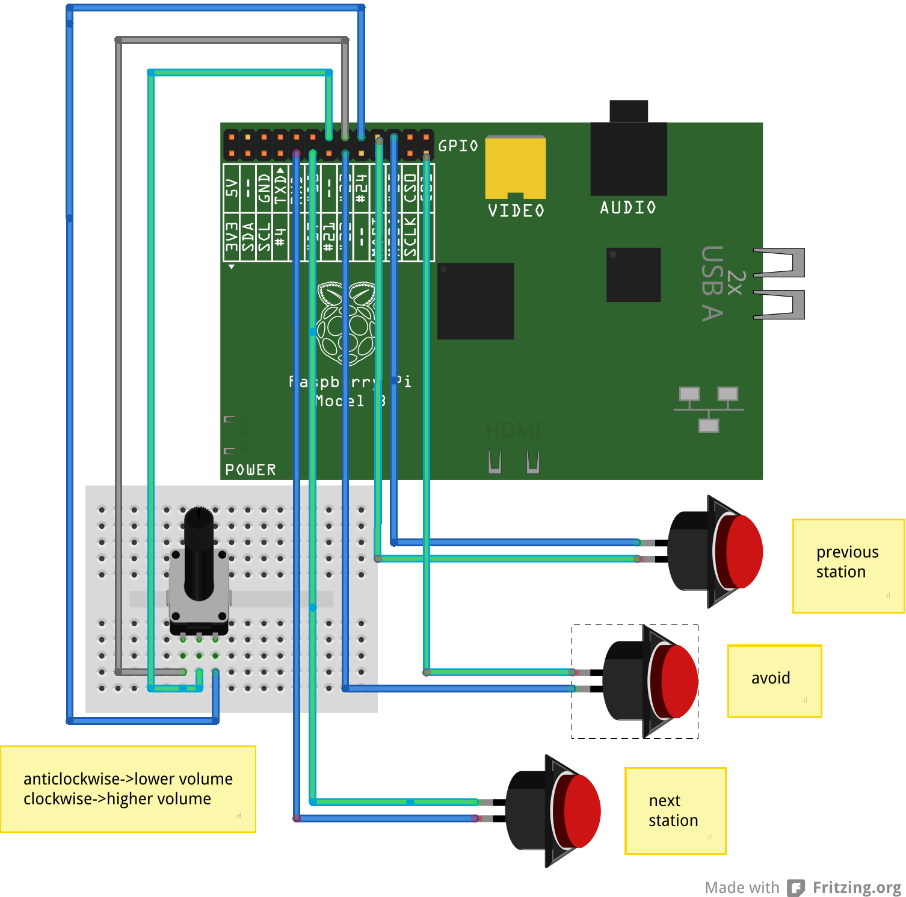

radiodan_example
================

## Candidate radio app

This is the start of a candidate application for releasing with v1 of the radiodan gem.

To run it:
- ./bin/start_radio
- sudo ./bin/start_frankenpins 
- ./bin/start_mqqt

It has three buttons and a rotary encoder.

The channel buttons are in pins 0 and 6 - the one in 0 cycles forwards through the stations, 6 goes backwards
The avoider button is in pin 3.

The rotary encoder is in pins 4 and 5 and controls volume (it's a bit crashy).

* Fritzing diagram is in [doc/](/doc/)
* Picture of the box: http://www.flickr.com/photos/nicecupoftea/10841160834/

